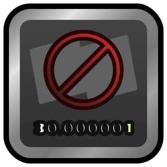

# HighPrecisionSaves



This mod changes some internal logic of Geometry Dash to allow working with full precision numeric values. This is effectively designed to fix the issues with the unmodded game where, for example, objects positioned in the editor using Free Move drift out of place a tiny bit after saving and reloading. For more information, see about.md.

## Build instructions
For more info, see [the Geode documentation](https://docs.geode-sdk.org/getting-started/create-mod#build)
```sh
# Assuming you have the Geode CLI set up already
geode build
```